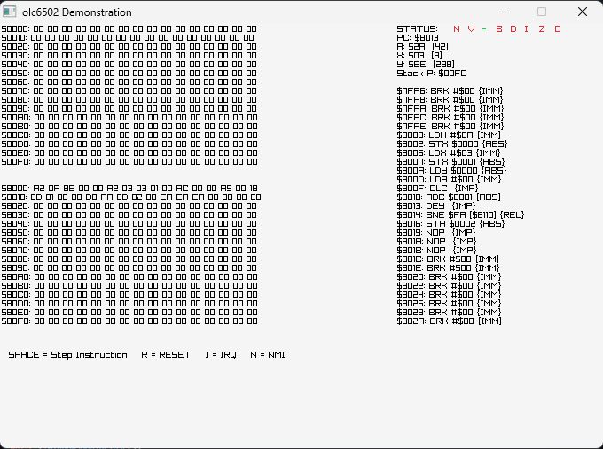

# NES Emulator

This is a simple NES emulator project based on the excellent YouTube series [NES Emulator from Scratch](https://www.youtube.com/watch?v=nViZg02IMQo&list=PLrOv9FMX8xJHqMvSGB_9G9nZZ_4IgteYf) by [javidx9](https://www.youtube.com/@javidx9), one of the best channels for learning recreational programming.

## Requirements

To compile and run this project, you’ll need to install [moonmake](https://github.com/ranon-rat/moonmake). The repository provides clear installation instructions—just follow the listed commands to get it set up on your system.

## Build Instructions

To build the project, simply run the following commands:

```sh
python3 build.py install
python3 build.py
```

If you encounter any issues during the build process, feel free to report them so I can update the build script accordingly.


## 6502 emulator


